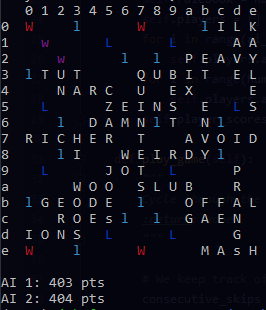

# Python Command-Line Scrabble

This is a command-line version of scrabble, which can be played by multiple people on the same machine or against an virtually unbeatable computer-controlled opponent or (opponents) which brute forces the best possible each turn. 

#### Requirements

Python 3.5 or higher. The only nonstandard packages used are colorama and ultrajson, and can be installed just through `pip3 install -r requirements.txt`

## Overview
I love scrabble, but I'm continuously disappointed by the quality of online scrabble games. A lot of them are slow, or require you to drag each tile on the board individually, or tell you if a word you're trying to play is in the dictionary which defeats a key part of the game, or have different two letter words than in the actual scrabble dictionary. This project is a command-line version of scrabble which can be played much more quickly than most web versions, and have a robust and reasonably challenging AI opponent (or opponents) to play against.

More than just providing  an alternate vector through which to play scrabble, this will be an exercise in a unique brand of game AI, as well as an algorithmic challenge as each player in scrabble has, including invalid options, a minimum of over a million possible moves at each turn, though there can be several billion moves available with certain held tiles and board configurations.

## How to play

To start the game, navigate to the game directory and run `python3 game_manager.py <number of human opponents> <number of computer-controlled opponents>`.

At each turn, the user has the following moves. 

`quit` quits the game

`skip` skips a turn

`exchange <LETTERS>` exchanges the tiles in the string (here letters) at the expense of a turn.

`7 7 R PYTHON` plays the word in the direction `R` for right (or `D` for down), starting at x, y, coordinates `7, 7`
